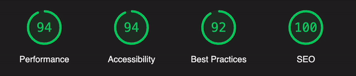

## omurcancengiz.com

Source codes of my personal website using Gatsby.js powered by Typescript.


[](http://opensource.org/licenses/MIT)

## Google Lighthouse Scores



## Installation and Running

Install dependencies

```javascript
npm install
```

Run

```javascript
npm run develop
```

### Possible Errors

When installing for the first time, if you get an **ERROR #98123**, deleted your `package-lock.json` file, `.cache` folder, `node_modules` folder and re-run the `npm install` command.

## License

This project is [MIT licensed](http://opensource.org/licenses/MIT).

<sub><sup>Copyright (c) 2018 Ömürcan Cengiz</sup></sub>
